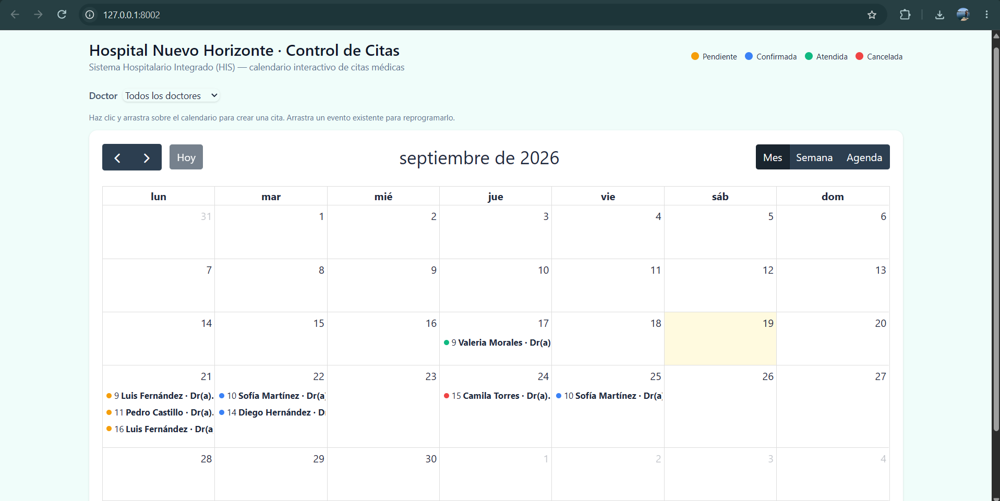
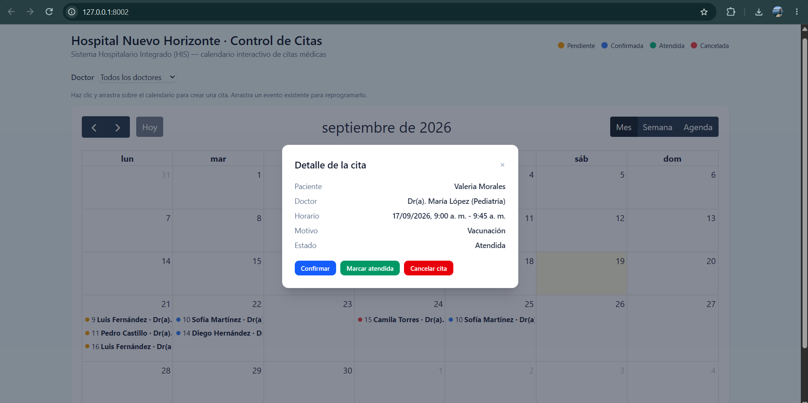
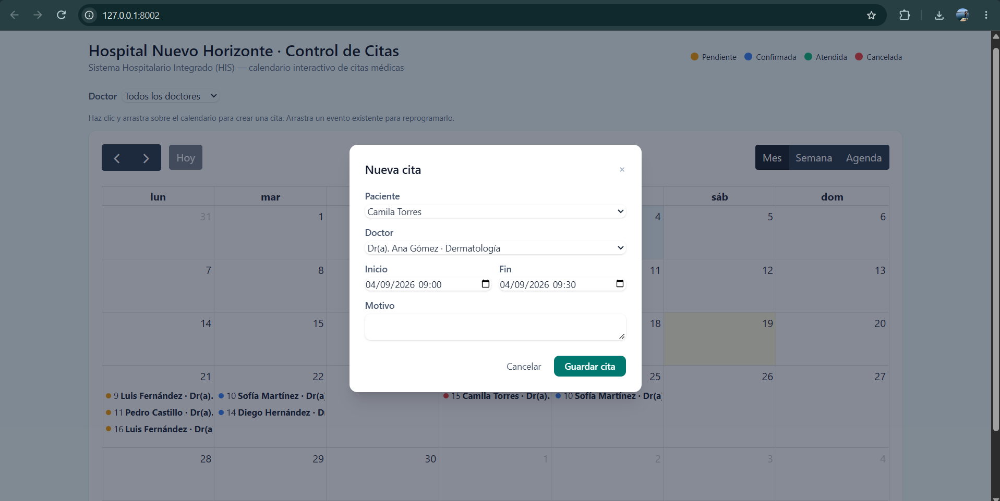
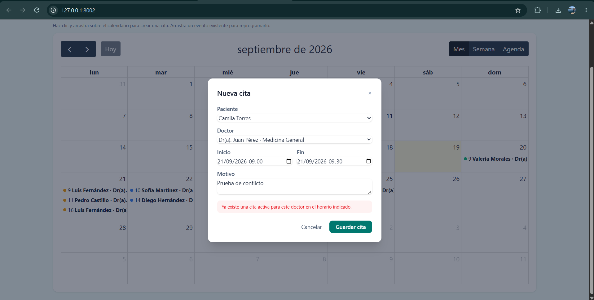
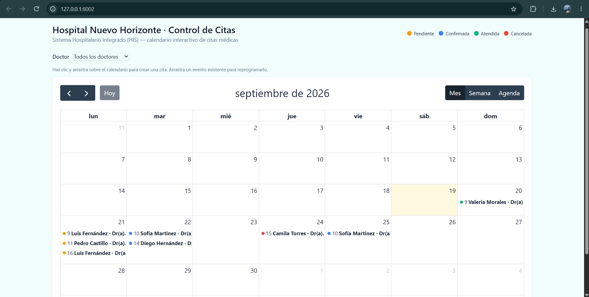

# EVIDENCIA.md — Módulo de Control de Citas Médicas (HIS)

Análisis de Sistemas II · Serie II · Repositorio: https://github.com/00AbiMendoza/his-citas-medicas

Este documento reúne la evidencia de cumplimiento de la Serie II: flujo Git, Docker + MySQL,
API REST y la interfaz de FullCalendar. Todos los comandos se ejecutaron el 19/09/2026 contra
el repositorio en su estado final (rama `main`).

---

## 1. Flujo Git (RQNF-05)

### 1.1 Pull Requests fusionados a `main`

| PR | Título | Rama | Alcance (RQF/RQNF) |
|---|---|---|---|
| [#1](https://github.com/00AbiMendoza/his-citas-medicas/pull/1) | Docker Compose + esquema MySQL y datos semilla | `feature/docker-mysql-schema` | RQF-01, RQNF-01, RQNF-02 |
| [#2](https://github.com/00AbiMendoza/his-citas-medicas/pull/2) | API REST de citas (CRUD, reprogramar, cambiar estado) | `feature/api-citas-crud` | RQF-01, 04-09, RQNF-03/04 |
| [#3](https://github.com/00AbiMendoza/his-citas-medicas/pull/3) | Endpoints de lectura de doctores y pacientes | `feature/api-doctores-pacientes` | RQF-07, RQNF-04 |
| [#4](https://github.com/00AbiMendoza/his-citas-medicas/pull/4) | Validación de doble reserva y manejo de estados | `feature/validacion-conflictos-estados` | RQF-03, RQF-05, RQF-10, RQNF-07 |
| [#5](https://github.com/00AbiMendoza/his-citas-medicas/pull/5) | Calendario base con FullCalendar | `feature/fullcalendar-ui-base` | RQF-02, RQF-09, RQF-10, RQNF-06 |
| [#6](https://github.com/00AbiMendoza/his-citas-medicas/pull/6) | Interacción del calendario (crear, drag&drop, estado, filtro) | `feature/fullcalendar-ui-interaccion` | RQF-01, 04, 05, 06, RQNF-04/07 |

6 ramas de feature (mínimo exigido: 4), cada una con su propio PR, descripción, evidencia y
merge real a `main` vía `gh pr merge --merge` (no squash, no fast-forward manual: el merge
queda registrado como commit propio en el historial).

### 1.2 `git log --graph --all`

```
*   16cc801 Merge pull request #6 from 00AbiMendoza/feature/fullcalendar-ui-interaccion
|\
| * 8894e88 feat(calendario): crear cita al hacer clic, reprogramar con drag&drop y cambiar estado desde el detalle (RQF-01, RQF-04, RQF-05, RQF-06)
| * 48574fa feat(calendario): agregar modal de creacion, botones de estado y filtro por doctor a la vista (RQF-01, RQF-05, RQF-06)
|/
*   e97da3a Merge pull request #5 from 00AbiMendoza/feature/fullcalendar-ui-base
|\
| * 79c4204 feat(calendario): vista de FullCalendar con colores por estado y detalle al hacer clic (RQF-02, RQF-09, RQF-10, RQNF-06)
| * 6f8624f chore(frontend): instalar FullCalendar y registrar entrada de Vite (RQF-02)
|/
*   ed9deb7 Merge pull request #4 from 00AbiMendoza/feature/validacion-conflictos-estados
|\
| * 3424f2a feat(estados): validar transiciones permitidas de estado y usar enum en la regla de entrada (RQF-05)
| * 77e79c4 feat(validacion): impedir doble reserva de horario en el servidor (RQF-03, RQNF-07)
| * 053e1ed feat(estados): agregar enum EstadoCita con colores y etiquetas para el calendario (RQF-10)
|/
*   3823646 Merge pull request #3 from 00AbiMendoza/feature/api-doctores-pacientes
|\
| * e1d3c5a feat(api): registrar rutas de doctores y pacientes en routes/api.php (RQF-07)
| * ea5d6dd feat(api): endpoints de lectura de doctores y pacientes (RQF-07)
|/
*   6389ad8 Merge pull request #2 from 00AbiMendoza/feature/api-citas-crud
|\
| * 232f368 feat(api): endpoints REST de citas - crear, listar, detalle, reprogramar, cambiar estado (RQF-01, RQF-04, RQF-05, RQF-06, RQF-07, RQF-09)
| * 6bfcf79 feat(validacion): agregar Form Requests para citas con respuesta 400 en datos invalidos (RQF-08, RQNF-03)
|/
*   05dea74 Merge pull request #1 from 00AbiMendoza/feature/docker-mysql-schema
|\
| * b9f7702 feat(seed): agregar datos semilla minimos de pacientes, doctores y citas
| * eecc5ac feat(schema): crear migraciones y modelos de pacientes, doctores y citas (RQF-01)
| * 1aa26a1 feat(docker): agregar docker-compose con MySQL 8 y persistencia por volumen (RQNF-01, RQNF-02)
|/
* 3e9e6ae chore: estructura inicial de Laravel 12 (composer create-project)
```

### 1.3 Ramas del repositorio (`git branch -a`)

```
* docs/evidencia-final
  feature/api-citas-crud
  feature/api-doctores-pacientes
  feature/docker-mysql-schema
  feature/fullcalendar-ui-base
  feature/fullcalendar-ui-interaccion
  feature/validacion-conflictos-estados
  main
  remotes/origin/feature/api-citas-crud
  remotes/origin/feature/api-doctores-pacientes
  remotes/origin/feature/docker-mysql-schema
  remotes/origin/feature/fullcalendar-ui-base
  remotes/origin/feature/fullcalendar-ui-interaccion
  remotes/origin/feature/validacion-conflictos-estados
  remotes/origin/main
```

---

## 2. Docker + MySQL (RQNF-01, RQNF-02)

### 2.1 `docker compose up -d` y persistencia

```
$ docker compose up -d
[+] Running 2/2
 ✔ Network his-citas-medicas_default  Created
 ✔ Container his_citas_mysql          Started

$ docker ps
CONTAINER ID   IMAGE       COMMAND                  CREATED          STATUS                    PORTS                                         NAMES
875e6f02cb55   mysql:8.0   "docker-entrypoint.s…"   36 minutes ago   Up 36 minutes (healthy)   0.0.0.0:3306->3306/tcp, [::]:3306->3306/tcp   his_citas_mysql

$ docker volume ls
DRIVER    VOLUME NAME
local     his-citas-medicas_his_citas_mysql_data
```

El volumen nombrado `his_citas_mysql_data` persiste los datos de MySQL entre reinicios del
contenedor (`docker compose down && docker compose up -d` no pierde datos).

### 2.2 Migraciones y datos semilla

```
$ php artisan migrate:fresh --seed

INFO  Running migrations.
  0001_01_01_000000_create_users_table ......... DONE
  0001_01_01_000001_create_cache_table ......... DONE
  0001_01_01_000002_create_jobs_table .......... DONE
  2026_09_19_134416_create_pacientes_table ..... DONE
  2026_09_19_134417_create_doctores_table ...... DONE
  2026_09_19_134418_create_citas_table ......... DONE

INFO  Seeding database.
  Database\Seeders\PacienteSeeder .............. DONE
  Database\Seeders\DoctorSeeder ................ DONE
  Database\Seeders\CitaSeeder .................. DONE
```

Datos semilla: 6 pacientes, 4 doctores, 8 citas (`database/seeders/`).

---

## 3. API REST (RQF-01, 03-09, RQNF-03, RQNF-07)

Todas las pruebas se ejecutaron con `curl` contra `php -S 127.0.0.1:8002 -t public`
(servidor PHP apuntando al mismo `.env` con `DB_CONNECTION=mysql`).

### GET /api/doctores → 200
```json
{"data":[{"id":4,"nombre":"Ana","apellido":"Gómez","nombre_completo":"Dr(a). Ana Gómez","especialidad":"Dermatología", ...}, ...]}
```

### GET /api/pacientes → 200
```json
{"data":[{"id":6,"nombre":"Camila","apellido":"Torres","nombre_completo":"Camila Torres", ...}, ...]}
```

### GET /api/citas?doctor_id=1 → 200 (filtrado)
```json
{"data":[{"id":1,"paciente_id":1,"doctor_id":1,"paciente":{"nombre_completo":"Luis Fernández", ...},
"doctor":{"nombre_completo":"Dr(a). Juan Pérez", ...},"fecha_inicio":"2026-09-21T09:00:00+00:00",
"estado":"pendiente","estado_label":"Pendiente","color":"#f59e0b", ...}]}
```

### POST /api/citas (datos válidos) → 201
```json
{"data":{"id":9,"paciente_id":3,"doctor_id":2,"motivo":"Evidencia EVIDENCIA.md","estado":"pendiente", ...}}
```

### POST /api/citas (falta `motivo`) → 400
```json
{"message":"Los datos proporcionados no son validos.","errors":{"motivo":["The motivo field is required."]}}
```

### POST /api/citas (choca con la cita 1, mismo doctor) → 409
```json
{"message":"Ya existe una cita activa para este doctor en el horario indicado."}
```

### GET /api/citas/9999 (no existe) → 404
```json
{"message":"No query results for model [App\\Models\\Cita] 9999", ...}
```

### PUT /api/citas/9 (reprogramar) → 200
```json
{"data":{"id":9,"fecha_inicio":"2026-10-01T11:00:00+00:00","fecha_fin":"2026-10-01T11:30:00+00:00", ...}}
```

### PATCH /api/citas/9/estado {"estado":"confirmada"} → 200
```json
{"data":{"id":9,"estado":"confirmada","estado_label":"Confirmada","color":"#3b82f6", ...}}
```

### PATCH /api/citas/6/estado {"estado":"confirmada"} sobre una cita **cancelada** → 409
```json
{"message":"No se puede cambiar el estado de 'Cancelada' a 'Confirmada'."}
```

**Resumen de códigos HTTP verificados:** 200 (listar/detalle/reprogramar/cambiar estado),
201 (crear), 400 (validación), 404 (no encontrado), 409 (conflicto de horario y transición
de estado inválida) — cumple RQNF-03 en su totalidad.

---

## 4. Interfaz FullCalendar (RQF-02, 04, 05, 06, 09, 10, RQNF-06)

Probado manualmente en navegador contra `http://127.0.0.1:8002/`:

- **Vista mes y semana** con locale español, mostrando los 8 eventos semilla con el color
  correcto por estado (naranja=pendiente, azul=confirmada, verde=atendida, rojo=cancelada).
- **Detalle al hacer clic**: abre un modal con paciente, doctor, horario, motivo y estado.
- **Crear cita al hacer clic** en un día/horario vacío: abre el modal "Nueva cita", que al
  guardar hace `POST /api/citas` y el evento aparece de inmediato en el calendario.
- **Reprogramar con drag & drop**: arrastrar un evento a otra fecha dispara
  `PUT /api/citas/{id}`; si el servidor devuelve 409/400 el evento **vuelve a su posición
  original** (`info.revert()`) y se muestra una alerta.
- **Cambiar estado** desde los botones Confirmar / Marcar atendida / Cancelar cita del modal
  de detalle (`PATCH /api/citas/{id}/estado`).
- **Filtro por doctor**: recarga los eventos con `?doctor_id=`.
- **Conflicto de horario visible en la UI**: crear una cita para un doctor en un horario ya
  ocupado muestra, dentro del propio formulario, "Ya existe una cita activa para este doctor
  en el horario indicado." sin cerrar el modal ni perder los datos escritos.
- **Responsivo**: probado en viewport 768×1024 (tablet) — calendario, leyenda y filtro
  siguen siendo legibles y usables (RQNF-06).
- Sin errores en la consola del navegador durante toda la sesión de pruebas.
- Bug de zona horaria detectado y corregido durante las pruebas: ver PR #6 para el detalle
  (FullCalendar y el modal ahora formatean en UTC para que "09:00" en la API se muestre
  siempre como "09:00", sin depender de la zona horaria del navegador).

### Capturas de pantalla

**Vista de mes con eventos coloreados por estado:**



**Detalle de una cita al hacer clic sobre el evento:**



**Modal "Nueva cita" al hacer clic sobre un día del calendario:**



**Validación de conflicto de horario (RQF-03/RQNF-07) mostrada en el propio formulario:**
se intentó crear una cita para el Dr. Juan Pérez el 21/09/2026 9:00-9:30, horario que ya
tiene ocupado con la cita de Luis Fernández. El servidor respondió 409 y el formulario lo
muestra sin cerrarse ni perder los datos escritos:



**Resultado de reprogramar una cita con drag & drop:** la cita de Valeria Morales se
arrastró del 17 de septiembre al 20 de septiembre; el cambio quedó persistido en la base de
datos vía `PUT /api/citas/{id}`:



---

## 5. Cómo levantar el proyecto

```bash
git clone https://github.com/00AbiMendoza/his-citas-medicas.git
cd his-citas-medicas
cp .env.example .env
composer install
php artisan key:generate
docker compose up -d          # MySQL con persistencia (RQNF-02: un solo comando)
php artisan migrate --seed
npm install && npm run build  # o "npm run dev" para desarrollo
php artisan serve
```

Luego abrir `http://127.0.0.1:8000/`.
